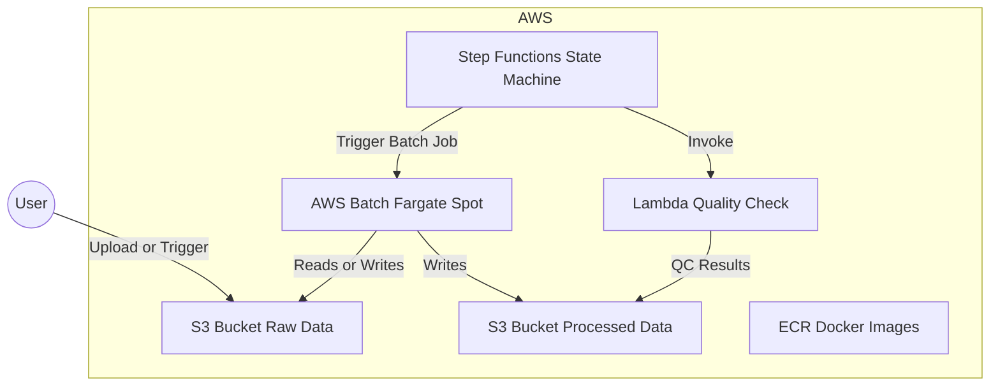
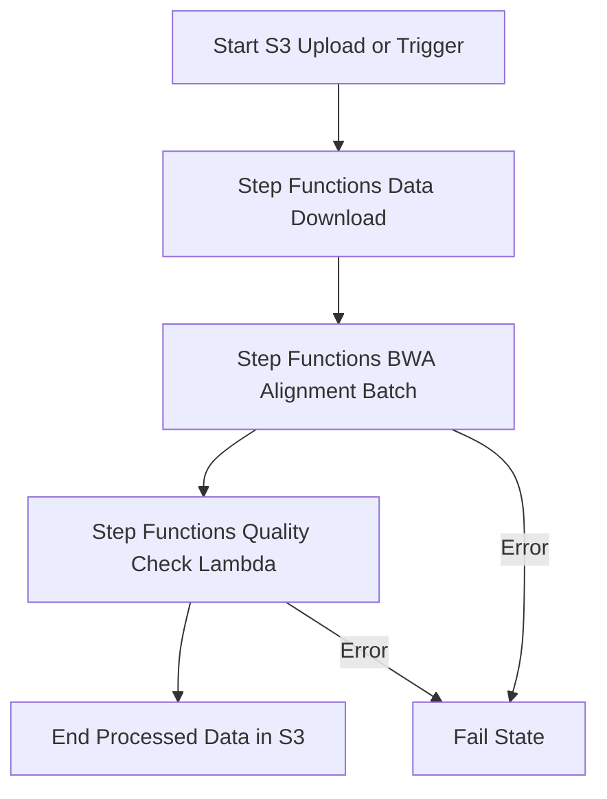
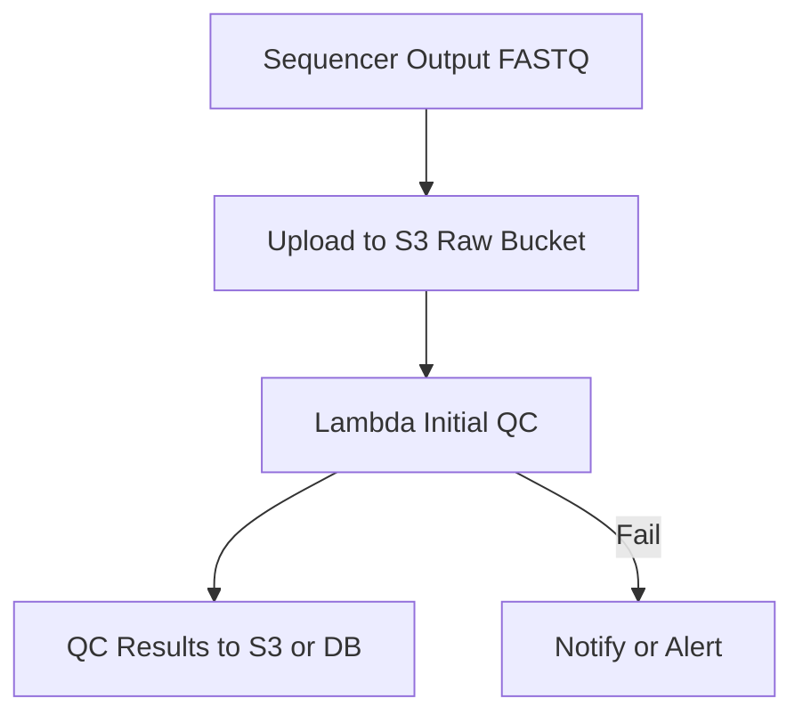
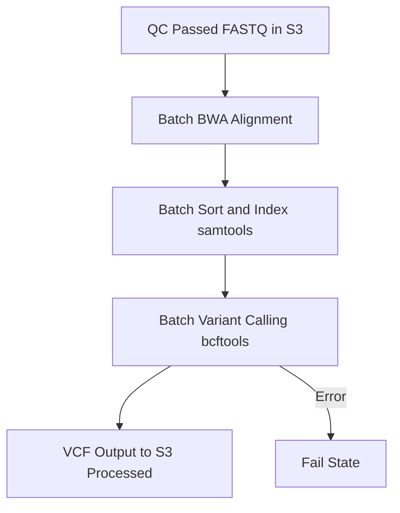
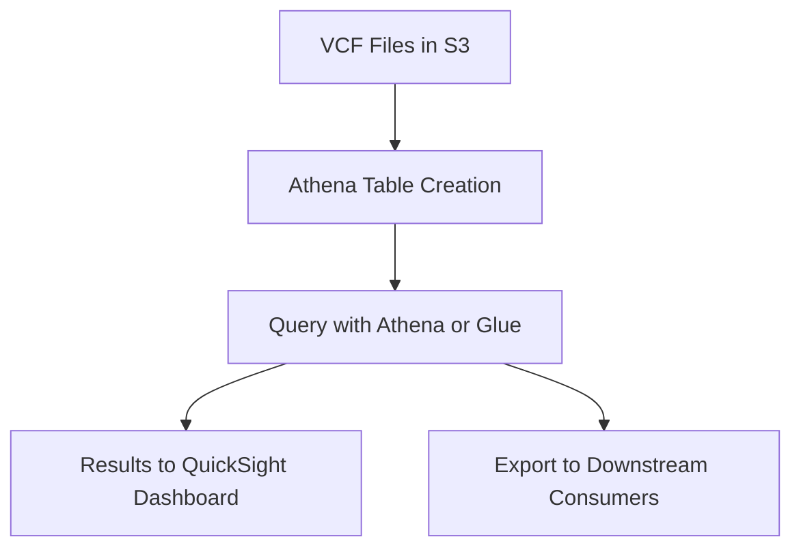

# Clinico-Genomic Data Pipeline on AWS CDK

## Architecture Diagram

```

## ETL Workflow Diagram


## Common Genomics Pipelines

### 1. Raw Data Ingestion & QC Pipeline


### 2. Alignment & Variant Calling Pipeline


### 3. Data Aggregation & Analytics Pipeline


This project demonstrates a professional-grade ETL pipeline for genomic data using AWS CDK, Docker, AWS Batch, and Step Functions.


## Project Structure
```
genomics-pipeline-cdk/
├── app.py
├── cdk.json
├── requirements.txt
├── genomics_pipeline/
│   ├── __init__.py
│   ├── genomics_pipeline_stack.py
│   ├── constructs/
│   │   ├── __init__.py
│   │   ├── batch_construct.py
│   │   ├── stepfunctions_construct.py
│   │   └── storage_construct.py
│   └── lambda_functions/
│       ├── __init__.py
│       ├── trigger_processor.py
│       └── quality_check.py
└── containers/
    └── bwa-mem/
        └── Dockerfile
```

## Quickstart

1. **Build Docker Image:**
   ```bash
   docker build -t bwa-pipeline:latest ./containers/bwa-mem/
   ```
2. **Authenticate and Push to ECR:**
   ```bash
   aws ecr get-login-password --region us-west-2 --profile jzhang2026 | docker login --username AWS --password-stdin 298843992168.dkr.ecr.us-west-2.amazonaws.com
   docker tag bwa-pipeline:latest 298843992168.dkr.ecr.us-west-2.amazonaws.com/bwa-pipeline:latest
   docker push 298843992168.dkr.ecr.us-west-2.amazonaws.com/bwa-pipeline:latest
   ```
3. **Deploy CDK Stack:**
   ```bash
   cd /Users/justin/aws_cdk/genomics-pipeline-cdk
   cdk deploy --profile jzhang2026
   ```
4. **Trigger the Pipeline:**
   ```bash
   python trigger_pipeline.py
   ```
5. **Check Results:**
   After a successful run, you should see a file like `HG00100.sam` in your processed S3 bucket (`helix-processed-genomics-data`).
## Alignment Step Example Output

After running the pipeline, the alignment step will produce a SAM file (e.g., `HG00100.sam`) in your processed S3 bucket. This file contains the aligned sequencing reads and can be used for downstream analysis (sorting, indexing, variant calling, etc.).

---

## Helix Interview Project Context
This project was developed as a demonstration for the Senior Genomics Data Engineer role at Helix. It showcases:
- Infrastructure as code (AWS CDK)
- Automated, scalable genomics ETL pipelines
- Secure, cost-effective, and reproducible cloud workflows
- Integration of bioinformatics tools (BWA, samtools) in AWS Batch

For more details, see the job description and interview preparation notes in the repository.
2. **Download Sample Data:**
   ```bash
   wget -P ./data/ https://ftp.ncbi.nlm.nih.gov/genomes/all/GCF/000/001/405/GCF_000001405.26_GRCh38/GCF_000001405.26_GRCh38_genomic.fna.gz
   gunzip ./data/GCF_000001405.26_GRCh38_genomic.fna.gz
   wget -P ./data/ ftp://ftp.1000genomes.ebi.ac.uk/vol1/ftp/phase3/data/HG00100/sequence_read/SRR062634_1.filt.fastq.gz
   ```
3. **Set up Python Environment:**
   ```bash
   python3 -m venv .venv
   source .venv/bin/activate
   pip install -r requirements.txt
   ```
4. **Bootstrap and Deploy CDK:**
   ```bash
   cdk bootstrap aws://<YOUR_ACCOUNT_ID>/<REGION>
   cdk synth
   cdk deploy --parameters RawBucketName=helix-raw-data-xyz
   ```
5. **Trigger Pipeline:**
   See the guide for a sample Python script to upload data and start the Step Functions pipeline.

## Cost Optimization
- Uses Fargate Spot for AWS Batch
- S3 lifecycle rules for auto-deletion
- Budget alarms recommended

---

---

## Project Documentation & Interview Talking Points

### Key Features
- **Infrastructure as Code:** All AWS resources (S3, Batch, Step Functions, IAM) are provisioned using AWS CDK (Python).
- **Reproducible Compute:** Bioinformatics tools (e.g., BWA-MEM) are containerized with Docker and run on AWS Batch Fargate Spot for cost savings.
- **Automated Data Ingestion:** Pipeline can download public genomic data directly within AWS, eliminating local data handling.
- **Orchestration:** Step Functions manage the ETL workflow, including error handling and retries.
- **Security Best Practices:**
  - IAM roles with least privilege
  - S3 encryption
  - Non-root Docker user
- **Cost Controls:**
  - Fargate Spot for Batch jobs
  - S3 lifecycle rules for auto-deletion
  - Budget alarms (recommended)

### How to Deploy and Run
1. **Set Up AWS Credentials**
   - Use an IAM user or SSO (never root keys).
   - Run `aws configure` or `aws configure sso` and `aws sso login`.
2. **Build and Push Docker Image**
   - `docker build -t bwa-pipeline ./containers/bwa-mem/`
   - Authenticate and push to ECR (see above for details)
3. **Deploy CDK Stack**
   - `cd genomics-pipeline-cdk`
   - `python3 -m venv .venv && source .venv/bin/activate && pip install -r requirements.txt`
   - `cdk bootstrap aws://<ACCOUNT_ID>/<REGION>`
   - `cdk deploy --parameters RawBucketName=helix-raw-genomics-data`
4. **Trigger the Pipeline**
   - Find your Step Functions ARN (see `get_state_machine_info.py`).
   - Edit `trigger_pipeline.py` with your ARN and run:
   - `python trigger_pipeline.py`

### What to Highlight in Your Interview
- "I built this pipeline with AWS CDK, demonstrating Infrastructure-as-Code expertise."
- "I used Docker for reproducibility and AWS Batch with Spot instances for cost-efficient genomics processing."
- "The Step Functions state machine ensures robustness with built-in retry and error handling."
- "I implemented security best practices: IAM roles with least privilege, S3 encryption, and a non-root Docker user."
- "This mirrors the need for scalable, secure pipelines that turn raw data into research-ready datasets."

### Next Steps / Extensions
- Add a de-identification step using Spark on EMR Serverless
- Create an Athena table over output VCFs for SQL querying
- Build a simple React frontend for researchers to trigger pipelines
- Implement data quality dashboards using Amazon QuickSight

---
